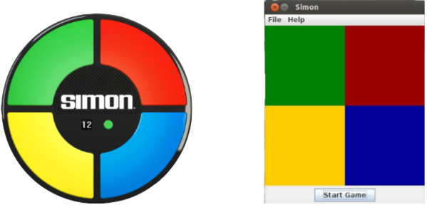

# Simon Game
* System presents a series of tones and lights and player repeats the sequence until mistake is made
* System adds one more pattern for every round the player succeeds
* Works just like Simon the boardgame

### Preview

### Software Requirement
* MIPS Assembler and Run-time Simulator (aka MARS)

### Installation

1. Download the repository files from the download section or clone this project by typing in the bash the following command:

       git clone https://github.com/hw35/Simon.git
3. Run MARS on the command line and open `simon.asm` file in MARS.
4. Open **Tools** tab in MARS and click on **Simon (Register) V0.1**
5. Run the program :)

### Sidenote
* The program can be a big slow when launched, so please be patient with the first few tones played
* It may take a second or two to register, but it'll get better as more rounds are played

### Contributing
This project is done independently by me, but
* If you want to contribute new ideas, your pull request is welcomed!
* If you find any issue, feel free to add to the repository issue section.

## Thank You!
