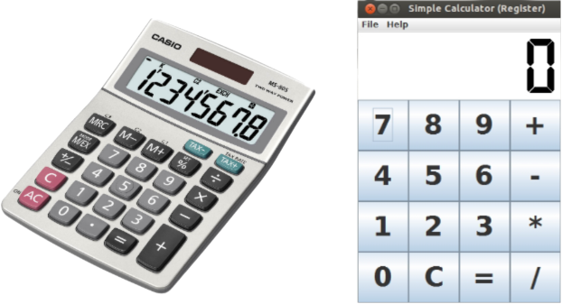

# Dollar Store Calculator
Simple Calculator for addition, subtraction, multiplication, division created with MIPS Assembly **MARS**
Each function coded from scratch without using built-in functions
Affords chain integer operations

### Preview

### Requirements
* MIPS Assembler and Run-time Simulator (aka MARS)

### Installation

1. Download the repository files from the download section or clone this project by typing in the bash the following command:

       git clone https://github.com/hw35/Calculator.git
2. Copy files from *Set_up* folder into *Tools* folder inside folder *mars4_5*
3. Run MARS on the command line and open Calculator.asm file in MARS.
4. Open **Tools** tab in MARS and click on **Simple Calculator Register V0.1**
5. Run the program!

### Contributing
This project is done independently by me.
If you want to contribute new ideas, your pull request is welcomed!
If you find any issue, feel free to add to the repository issue section.

## Thank You!
